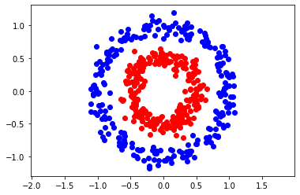
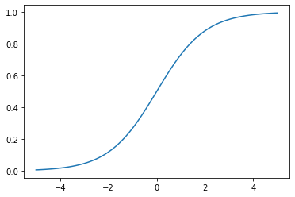
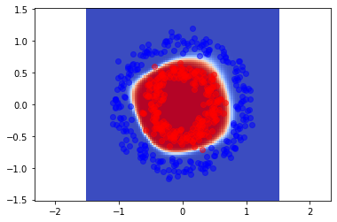
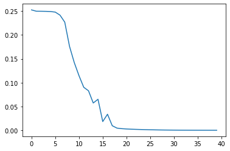

```python
import numpy as np
import scipy as sc
import matplotlib.pyplot as plt
from sklearn.datasets import make_circles
```

# Create dataset


```python
n=500
p=2 # number of attributes per sample
X , Y = make_circles(n_samples=n, factor=0.5, noise=0.08)

Y = Y[:, np.newaxis]

plt.scatter(X[Y[:, 0]==0,0], X[Y[:, 0]==0,1], c="blue")
plt.scatter(X[Y[:, 0]==1,0], X[Y[:, 0]==1,1], c="red")
plt.axis("equal")
plt.show()
```


    

    


# Layer class definition and activation function


```python
class neural_layer():
  def __init__(self, n_conn, n_neur, act_f):
    self.act_f= act_f
    self.b = np.random.rand(1, n_neur) * 2 - 1
    self.W = np.random.rand(n_conn, n_neur) * 2 - 1

```


```python
# Activation fuction and its derivative
sigm = (lambda x: 1/(1+np.e **(-x)), 
        lambda x: x * (1 - x))

_x= np.linspace(-5, 5 , 100)
plt.plot(_x , sigm[0](_x))
```


    [<matplotlib.lines.Line2D at 0x168dd900ac0>]


    

    


# Create network


```python
def create_nn(topology, act_f):
  nn = []
  for l, layer in enumerate(topology[:-1]):
    nn.append(neural_layer(topology[l], topology[l+1], act_f))
  return nn
```


```python
topology= [p, 4, 8, 4, 1] 
neural_net = create_nn(topology, sigm)
```


```python
# Define cost function and its derivative
l2_cost = (lambda Yp, Yr: np.mean((Yp - Yr)**2),
           lambda Yp, Yr: (Yp - Yr))


# Define train function
def train(neural_net, X, Y, l2_cost, lr=0.5, train=True):
  out= [(None, X)]
  # Forward pass
  for l, layer in enumerate(neural_net):
        z = out[-1][1].dot(neural_net[l].W) + neural_net[l].b
        a = neural_net[l].act_f[0](z)
        out.append((z, a))
  
  if train:
        
   # Backward pass
      deltas = []

      for l in reversed(range(0, len(neural_net))):
          z = out[l+1][0]
          a = out[l+1][1]

          if l == len(neural_net)-1:
            deltas.insert(0, l2_cost[1](a, Y) * neural_net[l].act_f[1](a))
          else:
            deltas.insert(0, deltas[0] @ _W.T * neural_net[l].act_f[1](a))
          _W = neural_net[l].W

          # Gradient descent
          neural_net[l].b = neural_net[l].b - np.mean(deltas[0], axis=0, keepdims=True) * lr
          neural_net[l].W = neural_net[l].W - out[l][1].T @ deltas[0] * lr

  return out [-1][1]

# Train network
train(neural_net, X, Y, l2_cost, 0.5, train=True)

```


    array([[0.58733826],
           [0.58656217],
           [0.58759513],
           [0.58483503],
           [0.58781504],
           [0.58658887],
           [0.58922927],
           [0.5839924 ],
           [0.58463811],
           [0.58895591],
           [0.58562768],
           [0.58625081],
           [0.58637551],
           [0.58698856],
           [0.5873457 ],
           [0.58785332],
           [0.58818251],
           [0.58673954],
           [0.58435826],
           [0.58530144],
           [0.58574235],
           [0.58558403],
           [0.58636313],
           [0.58549551],
           [0.58524687],
           [0.58698085],
           [0.58695167],
           [0.58535843],
           [0.58670206],
           [0.58738476],
           [0.58720155],
           [0.58776778],
           [0.58610497],
           [0.58472796],
           [0.58785387],
           [0.58887552],
           [0.58698519],
           [0.58903442],
           [0.58463361],
           [0.58861689],
           [0.58548572],
           [0.58725422],
           [0.58684908],
           [0.58529026],
           [0.58613462],
           [0.58786071],
           [0.58536735],
           [0.58404331],
           [0.58557979],
           [0.58662876],
           [0.58502824],
           [0.58781448],
           [0.58589302],
           [0.58667407],
           [0.58501905],
           [0.58791227],
           [0.58594435],
           [0.58550004],
           [0.58554507],
           [0.58670228],
           [0.58571387],
           [0.58519993],
           [0.58721808],
           [0.58552608],
           [0.58620912],
           [0.58570107],
           [0.58405619],
           [0.5881477 ],
           [0.58445515],
           [0.58475628],
           [0.58746041],
           [0.58429173],
           [0.58587058],
           [0.58686246],
           [0.58921171],
           [0.58747981],
           [0.58512929],
           [0.58559744],
           [0.58533503],
           [0.58718193],
           [0.58539004],
           [0.5889289 ],
           [0.58573994],
           [0.58429611],
           [0.58880894],
           [0.5888994 ],
           [0.58705716],
           [0.58652191],
           [0.58662798],
           [0.58772972],
           [0.58600176],
           [0.58555635],
           [0.5856611 ],
           [0.58638918],
           [0.58598839],
           [0.58618691],
           [0.58412471],
           [0.58791795],
           [0.587683  ],
           [0.58411791],
           [0.58681446],
           [0.58902576],
           [0.58594192],
           [0.58593834],
           [0.58437865],
           [0.58749822],
           [0.58657153],
           [0.58511311],
           [0.58487177],
           [0.58446225],
           [0.58648197],
           [0.58750275],
           [0.58752746],
           [0.58899901],
           [0.58521999],
           [0.58441517],
           [0.5888352 ],
           [0.58759657],
           [0.58783316],
           [0.58520853],
           [0.58421807],
           [0.58600664],
           [0.58648046],
           [0.58674748],
           [0.58773959],
           [0.58630869],
           [0.58752656],
           [0.58694131],
           [0.58579423],
           [0.58647769],
           [0.58699814],
           [0.58570167],
           [0.58468857],
           [0.58560902],
           [0.58739705],
           [0.58756193],
           [0.58858641],
           [0.5842905 ],
           [0.58801909],
           [0.58858075],
           [0.58584447],
           [0.58837213],
           [0.58676994],
           [0.58561409],
           [0.58691012],
           [0.58539673],
           [0.58754149],
           [0.58692353],
           [0.58511961],
           [0.58682367],
           [0.58553805],
           [0.58716985],
           [0.58735688],
           [0.5871233 ],
           [0.58688813],
           [0.58569245],
           [0.58600919],
           [0.58916377],
           [0.58524504],
           [0.58731525],
           [0.58427948],
           [0.58669052],
           [0.58644694],
           [0.5843161 ],
           [0.58517881],
           [0.58559057],
           [0.58736506],
           [0.58916465],
           [0.5862903 ],
           [0.58556526],
           [0.58750075],
           [0.58559829],
           [0.58414865],
           [0.58743573],
           [0.58526114],
           [0.58672842],
           [0.58756366],
           [0.58838434],
           [0.58526425],
           [0.58538129],
           [0.5864172 ],
           [0.58764692],
           [0.58539126],
           [0.58541598],
           [0.58439636],
           [0.5858186 ],
           [0.58510933],
           [0.58719575],
           [0.58883384],
           [0.58505781],
           [0.58717122],
           [0.58706147],
           [0.5851859 ],
           [0.58540801],
           [0.58522753],
           [0.58861845],
           [0.58769851],
           [0.58635119],
           [0.58444968],
           [0.58683252],
           [0.58631414],
           [0.58600533],
           [0.5859848 ],
           [0.58653503],
           [0.58751364],
           [0.58651311],
           [0.58666093],
           [0.5881853 ],
           [0.58606104],
           [0.58607753],
           [0.58497217],
           [0.58578151],
           [0.58464333],
           [0.58744374],
           [0.58888357],
           [0.58700427],
           [0.5872555 ],
           [0.58457571],
           [0.58770949],
           [0.58622586],
           [0.5875436 ],
           [0.5871124 ],
           [0.58836652],
           [0.58748761],
           [0.58844264],
           [0.58410493],
           [0.58913055],
           [0.58773861],
           [0.58642722],
           [0.58477331],
           [0.58599   ],
           [0.58692586],
           [0.58573933],
           [0.5887817 ],
           [0.58828769],
           [0.58425522],
           [0.58468546],
           [0.5875561 ],
           [0.5857918 ],
           [0.58851215],
           [0.58836754],
           [0.58540176],
           [0.58679008],
           [0.58630925],
           [0.58789385],
           [0.58415532],
           [0.58810235],
           [0.58875115],
           [0.58887382],
           [0.58430991],
           [0.5857367 ],
           [0.58579376],
           [0.58572043],
           [0.58532714],
           [0.58631688],
           [0.5867355 ],
           [0.58721846],
           [0.5863609 ],
           [0.58869416],
           [0.58634174],
           [0.58741329],
           [0.58472369],
           [0.58448964],
           [0.58769193],
           [0.58413706],
           [0.58758825],
           [0.58655421],
           [0.5845413 ],
           [0.58913474],
           [0.58424876],
           [0.58603115],
           [0.58534211],
           [0.58406161],
           [0.58734345],
           [0.58767466],
           [0.58706647],
           [0.58524114],
           [0.58622514],
           [0.58552983],
           [0.58686609],
           [0.58584545],
           [0.58713588],
           [0.58546803],
           [0.58527487],
           [0.58444094],
           [0.58459144],
           [0.58903   ],
           [0.58821544],
           [0.58583912],
           [0.58750025],
           [0.58631444],
           [0.58658015],
           [0.58701403],
           [0.58776181],
           [0.58587892],
           [0.58494429],
           [0.58758466],
           [0.58639364],
           [0.58744649],
           [0.58854393],
           [0.58809331],
           [0.58773824],
           [0.58458638],
           [0.5860301 ],
           [0.58608122],
           [0.5840485 ],
           [0.58645288],
           [0.58622621],
           [0.58740598],
           [0.58639106],
           [0.58427342],
           [0.58846029],
           [0.58518441],
           [0.58604108],
           [0.58530073],
           [0.588786  ],
           [0.58707662],
           [0.58550191],
           [0.58746604],
           [0.58700116],
           [0.58587906],
           [0.58854058],
           [0.58627372],
           [0.58604022],
           [0.58548831],
           [0.58499173],
           [0.58746508],
           [0.58752099],
           [0.58568822],
           [0.58762139],
           [0.58547166],
           [0.58530897],
           [0.58635063],
           [0.58564021],
           [0.58828761],
           [0.58597715],
           [0.58639264],
           [0.58785565],
           [0.58761537],
           [0.5874029 ],
           [0.58892004],
           [0.58710572],
           [0.58769631],
           [0.58832795],
           [0.58475067],
           [0.58526844],
           [0.58707732],
           [0.58456116],
           [0.58504139],
           [0.58436502],
           [0.58516359],
           [0.58751239],
           [0.58602686],
           [0.58498904],
           [0.58611963],
           [0.58771164],
           [0.58739523],
           [0.58451303],
           [0.5887134 ],
           [0.58716478],
           [0.5857575 ],
           [0.5841024 ],
           [0.58900381],
           [0.58862015],
           [0.58784676],
           [0.5845308 ],
           [0.58761968],
           [0.58753347],
           [0.58614197],
           [0.58645766],
           [0.5862879 ],
           [0.58566914],
           [0.5870126 ],
           [0.58614236],
           [0.58697225],
           [0.58778951],
           [0.58830631],
           [0.58751637],
           [0.58680258],
           [0.58496091],
           [0.58642044],
           [0.58705268],
           [0.58556089],
           [0.58729465],
           [0.5875437 ],
           [0.58744126],
           [0.58803242],
           [0.58447425],
           [0.58907946],
           [0.58445732],
           [0.58758331],
           [0.58730563],
           [0.58805024],
           [0.58675581],
           [0.58623476],
           [0.5888583 ],
           [0.58647478],
           [0.5889522 ],
           [0.58807508],
           [0.58841887],
           [0.5870689 ],
           [0.5869559 ],
           [0.5846362 ],
           [0.58668944],
           [0.58741507],
           [0.58728267],
           [0.58918001],
           [0.58795457],
           [0.58558583],
           [0.58534236],
           [0.58518956],
           [0.58453537],
           [0.58695143],
           [0.58799108],
           [0.58872049],
           [0.58851429],
           [0.5875959 ],
           [0.5881047 ],
           [0.58744201],
           [0.58592268],
           [0.58535703],
           [0.58533573],
           [0.58800434],
           [0.5874746 ],
           [0.58564332],
           [0.58807654],
           [0.58493025],
           [0.58497031],
           [0.58407933],
           [0.58625592],
           [0.58582657],
           [0.58886069],
           [0.58393491],
           [0.58857115],
           [0.58679396],
           [0.58667137],
           [0.58758406],
           [0.58461   ],
           [0.58787881],
           [0.5854864 ],
           [0.58762247],
           [0.58526596],
           [0.58522269],
           [0.58891354],
           [0.58648084],
           [0.58731977],
           [0.58621502],
           [0.58755997],
           [0.58443949],
           [0.58851692],
           [0.58734634],
           [0.58842233],
           [0.58859679],
           [0.58517196],
           [0.58551454],
           [0.58510844],
           [0.58415562],
           [0.58543569],
           [0.58531784],
           [0.58578219],
           [0.58674498],
           [0.58496621],
           [0.58542418],
           [0.58773277],
           [0.58641576],
           [0.5879398 ],
           [0.58773793],
           [0.58627325],
           [0.58553572],
           [0.58882096],
           [0.58628633],
           [0.58643858],
           [0.58543133],
           [0.58611607],
           [0.58396579],
           [0.58542707],
           [0.58623617],
           [0.58657571],
           [0.58778721],
           [0.58493105],
           [0.58729888],
           [0.58826153],
           [0.5891827 ],
           [0.58764344],
           [0.58791465],
           [0.58598654],
           [0.58641424],
           [0.58802807],
           [0.5844964 ],
           [0.58601505],
           [0.58550004],
           [0.5860185 ],
           [0.58745585],
           [0.58805143],
           [0.58530655],
           [0.58546489],
           [0.58710311],
           [0.58816424],
           [0.58890671],
           [0.58501071]])


# Check that the network works


```python
import time
from IPython.display import clear_output

neural_n = create_nn(topology, sigm) # Create neuronal network

loss=[] # cost difference over the time


for i in range(2000): # High number of iterations
  # Train network
  pY = train(neural_n, X, Y, l2_cost, lr=0.05)
 # Every 50 iterations, compute the cost and add it to loss
  if i % 50 == 0: #  if i % 25 == 0:
    loss.append(l2_cost[0](pY, Y))
    
    resolution=100
    _x0 = np.linspace(-1.5,1.5, resolution)
    _x1 = np.linspace(-1.5,1.5, resolution)

    _Y = np.zeros((res,res))

    for i0, x0 in enumerate(_x0):
      for i1, x1 in enumerate(_x1):
        _Y[i0, i1] = train(neural_n, np.array([[x0, x1]]), Y, l2_cost, train=False)[0][0]
    plt.show()
    plt.pcolormesh(_x0, _x1, _Y, cmap="coolwarm")
    plt.axis("equal")
    plt.scatter(X[Y[:,0]== 0, 0], X[Y[:,0]== 0, 1], c = 'blue',alpha=0.5)
    plt.scatter(X[Y[:,0]== 1, 0], X[Y[:,0]== 1, 1], c = 'red',alpha=0.5)

    # Clean and re-draw output to have an animated display
    clear_output(wait=True)
    plt.show()
    plt.plot(range(len(loss)), loss)
    plt.show()
    time.sleep(0.05)


```


    

    


    

    


```python

```
