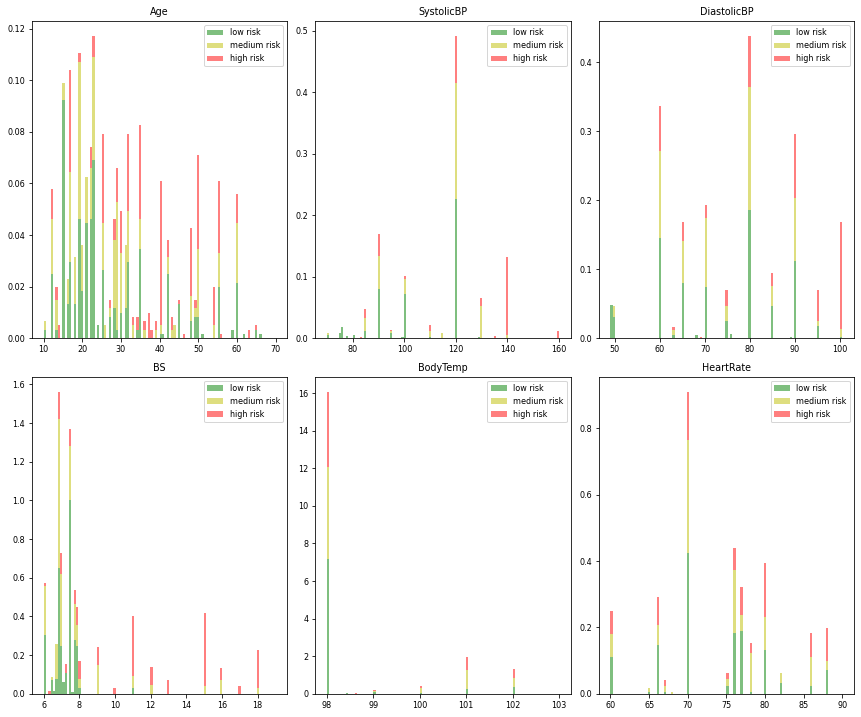
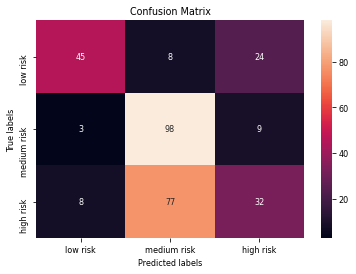
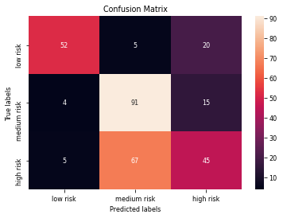
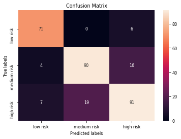
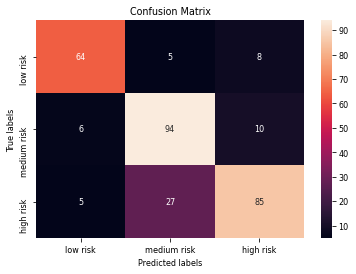
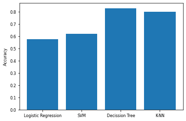

# Import packages


```python
import pandas as pd
import numpy as np
import matplotlib.pyplot as plt
import seaborn as sns
from sklearn import preprocessing
from sklearn.model_selection import train_test_split
from sklearn.model_selection import GridSearchCV
from sklearn.linear_model import LogisticRegression
from sklearn.svm import SVC
from sklearn.tree import DecisionTreeClassifier
from sklearn.neighbors import KNeighborsClassifier
from sklearn import metrics
```

# About Dataset: Maternal Health Risk Data Set Data Set
Data set source: https://archive.ics.uci.edu/ml/datasets/Maternal+Health+Risk+Data+Set#

Data has been collected from different hospitals, community clinics, maternal health cares from the rural areas of Bangladesh through the IoT based risk monitoring system.

Attribute Information:

* Age: Any ages in years when a women during pregnant.
* SystolicBP: Upper value of Blood Pressure in mmHg, another significant attribute during pregnancy.
* DiastolicBP: Lower value of Blood Pressure in mmHg, another significant attribute during pregnancy.
* BS: Blood glucose levels is in terms of a molar concentration, mmol/L.
* HeartRate: A normal resting heart rate in beats per minute.
* Risk Level: Predicted Risk Intensity Level during pregnancy considering the previous attribute.


<div id="downloading_data"> 


```python
my_data = pd.read_csv('Maternal Health Risk Data Set.csv',  sep=",")
my_data.describe()
```


<div>
<style scoped>
    .dataframe tbody tr th:only-of-type {
        vertical-align: middle;
    }

    .dataframe tbody tr th {
        vertical-align: top;
    }

    .dataframe thead th {
        text-align: right;
    }
</style>
<table border="1" class="dataframe">
  <thead>
    <tr style="text-align: right;">
      <th></th>
      <th>Age</th>
      <th>SystolicBP</th>
      <th>DiastolicBP</th>
      <th>BS</th>
      <th>BodyTemp</th>
      <th>HeartRate</th>
    </tr>
  </thead>
  <tbody>
    <tr>
      <th>count</th>
      <td>1014.000000</td>
      <td>1014.000000</td>
      <td>1014.000000</td>
      <td>1014.000000</td>
      <td>1014.000000</td>
      <td>1014.000000</td>
    </tr>
    <tr>
      <th>mean</th>
      <td>29.871795</td>
      <td>113.198225</td>
      <td>76.460552</td>
      <td>8.725986</td>
      <td>98.665089</td>
      <td>74.301775</td>
    </tr>
    <tr>
      <th>std</th>
      <td>13.474386</td>
      <td>18.403913</td>
      <td>13.885796</td>
      <td>3.293532</td>
      <td>1.371384</td>
      <td>8.088702</td>
    </tr>
    <tr>
      <th>min</th>
      <td>10.000000</td>
      <td>70.000000</td>
      <td>49.000000</td>
      <td>6.000000</td>
      <td>98.000000</td>
      <td>7.000000</td>
    </tr>
    <tr>
      <th>25%</th>
      <td>19.000000</td>
      <td>100.000000</td>
      <td>65.000000</td>
      <td>6.900000</td>
      <td>98.000000</td>
      <td>70.000000</td>
    </tr>
    <tr>
      <th>50%</th>
      <td>26.000000</td>
      <td>120.000000</td>
      <td>80.000000</td>
      <td>7.500000</td>
      <td>98.000000</td>
      <td>76.000000</td>
    </tr>
    <tr>
      <th>75%</th>
      <td>39.000000</td>
      <td>120.000000</td>
      <td>90.000000</td>
      <td>8.000000</td>
      <td>98.000000</td>
      <td>80.000000</td>
    </tr>
    <tr>
      <th>max</th>
      <td>70.000000</td>
      <td>160.000000</td>
      <td>100.000000</td>
      <td>19.000000</td>
      <td>103.000000</td>
      <td>90.000000</td>
    </tr>
  </tbody>
</table>
</div>


Clean data: a HeartRate of 7 is not feasible.


```python
my_data = my_data[my_data.HeartRate != 7]
```


```python
my_data.describe()
```


<div>
<style scoped>
    .dataframe tbody tr th:only-of-type {
        vertical-align: middle;
    }

    .dataframe tbody tr th {
        vertical-align: top;
    }

    .dataframe thead th {
        text-align: right;
    }
</style>
<table border="1" class="dataframe">
  <thead>
    <tr style="text-align: right;">
      <th></th>
      <th>Age</th>
      <th>SystolicBP</th>
      <th>DiastolicBP</th>
      <th>BS</th>
      <th>BodyTemp</th>
      <th>HeartRate</th>
    </tr>
  </thead>
  <tbody>
    <tr>
      <th>count</th>
      <td>1012.000000</td>
      <td>1012.000000</td>
      <td>1012.000000</td>
      <td>1012.000000</td>
      <td>1012.000000</td>
      <td>1012.000000</td>
    </tr>
    <tr>
      <th>mean</th>
      <td>29.899209</td>
      <td>113.184783</td>
      <td>76.463439</td>
      <td>8.727619</td>
      <td>98.666403</td>
      <td>74.434783</td>
    </tr>
    <tr>
      <th>std</th>
      <td>13.473560</td>
      <td>18.419618</td>
      <td>13.899372</td>
      <td>3.296583</td>
      <td>1.372421</td>
      <td>7.521857</td>
    </tr>
    <tr>
      <th>min</th>
      <td>10.000000</td>
      <td>70.000000</td>
      <td>49.000000</td>
      <td>6.000000</td>
      <td>98.000000</td>
      <td>60.000000</td>
    </tr>
    <tr>
      <th>25%</th>
      <td>19.000000</td>
      <td>100.000000</td>
      <td>65.000000</td>
      <td>6.900000</td>
      <td>98.000000</td>
      <td>70.000000</td>
    </tr>
    <tr>
      <th>50%</th>
      <td>26.000000</td>
      <td>120.000000</td>
      <td>80.000000</td>
      <td>7.500000</td>
      <td>98.000000</td>
      <td>76.000000</td>
    </tr>
    <tr>
      <th>75%</th>
      <td>39.000000</td>
      <td>120.000000</td>
      <td>90.000000</td>
      <td>8.000000</td>
      <td>98.000000</td>
      <td>80.000000</td>
    </tr>
    <tr>
      <th>max</th>
      <td>70.000000</td>
      <td>160.000000</td>
      <td>100.000000</td>
      <td>19.000000</td>
      <td>103.000000</td>
      <td>90.000000</td>
    </tr>
  </tbody>
</table>
</div>


# Pre-processing:  Feature selection/extraction
<ul>
    <li> <b> X </b> as the <b> Feature Matrix </b> (data of my_data) </li>
    <li> <b> y </b> as the <b> response vector </b> (target) </li>
</ul>


```python
Y=my_data["RiskLevel"]
Y.value_counts()
```


    low risk     404
    mid risk     336
    high risk    272
    Name: RiskLevel, dtype: int64


```python
X=my_data[["Age","SystolicBP", "DiastolicBP", "BS", "BodyTemp","HeartRate"]]
X
```


<div>
<style scoped>
    .dataframe tbody tr th:only-of-type {
        vertical-align: middle;
    }

    .dataframe tbody tr th {
        vertical-align: top;
    }

    .dataframe thead th {
        text-align: right;
    }
</style>
<table border="1" class="dataframe">
  <thead>
    <tr style="text-align: right;">
      <th></th>
      <th>Age</th>
      <th>SystolicBP</th>
      <th>DiastolicBP</th>
      <th>BS</th>
      <th>BodyTemp</th>
      <th>HeartRate</th>
    </tr>
  </thead>
  <tbody>
    <tr>
      <th>0</th>
      <td>25</td>
      <td>130</td>
      <td>80</td>
      <td>15.0</td>
      <td>98.0</td>
      <td>86</td>
    </tr>
    <tr>
      <th>1</th>
      <td>35</td>
      <td>140</td>
      <td>90</td>
      <td>13.0</td>
      <td>98.0</td>
      <td>70</td>
    </tr>
    <tr>
      <th>2</th>
      <td>29</td>
      <td>90</td>
      <td>70</td>
      <td>8.0</td>
      <td>100.0</td>
      <td>80</td>
    </tr>
    <tr>
      <th>3</th>
      <td>30</td>
      <td>140</td>
      <td>85</td>
      <td>7.0</td>
      <td>98.0</td>
      <td>70</td>
    </tr>
    <tr>
      <th>4</th>
      <td>35</td>
      <td>120</td>
      <td>60</td>
      <td>6.1</td>
      <td>98.0</td>
      <td>76</td>
    </tr>
    <tr>
      <th>...</th>
      <td>...</td>
      <td>...</td>
      <td>...</td>
      <td>...</td>
      <td>...</td>
      <td>...</td>
    </tr>
    <tr>
      <th>1009</th>
      <td>22</td>
      <td>120</td>
      <td>60</td>
      <td>15.0</td>
      <td>98.0</td>
      <td>80</td>
    </tr>
    <tr>
      <th>1010</th>
      <td>55</td>
      <td>120</td>
      <td>90</td>
      <td>18.0</td>
      <td>98.0</td>
      <td>60</td>
    </tr>
    <tr>
      <th>1011</th>
      <td>35</td>
      <td>85</td>
      <td>60</td>
      <td>19.0</td>
      <td>98.0</td>
      <td>86</td>
    </tr>
    <tr>
      <th>1012</th>
      <td>43</td>
      <td>120</td>
      <td>90</td>
      <td>18.0</td>
      <td>98.0</td>
      <td>70</td>
    </tr>
    <tr>
      <th>1013</th>
      <td>32</td>
      <td>120</td>
      <td>65</td>
      <td>6.0</td>
      <td>101.0</td>
      <td>76</td>
    </tr>
  </tbody>
</table>
<p>1012 rows × 6 columns</p>
</div>


```python
# Normalize data
X = preprocessing.StandardScaler().fit(X).transform(X)
```

# Data visualization


```python
features=list(my_data.columns[0:6])
# split dataframe into tree posible level risk
df_l=my_data[my_data['RiskLevel'] =='low risk']
df_m=my_data[my_data['RiskLevel'] =='mid risk']
df_h=my_data[my_data['RiskLevel'] =='high risk']
```


```python
features
```


    ['Age', 'SystolicBP', 'DiastolicBP', 'BS', 'BodyTemp', 'HeartRate']


```python
#Stack the data
plt.rcParams.update({'font.size': 8})
fig, axes = plt.subplots(nrows=2, ncols=3, figsize=(12,10))
axes = axes.ravel()
for idx,ax in enumerate(axes):
    ax.figure
    binwidth= (max(my_data[features[idx]]) - min(my_data[features[idx]]))/100
    ax.hist([df_l[features[idx]],df_m[features[idx]],df_h[features[idx]]], bins=np.arange(min(my_data[features[idx]]), max(my_data[features[idx]]) + binwidth, binwidth) ,
            alpha=0.5,stacked=True, density = True, label=['low risk','medium risk','high risk'],color=['g','y', 'r'])
    ax.legend(loc='upper right')
    ax.set_title(features[idx])
plt.tight_layout()
plt.show()
```


    

    


**Conlcusion**

When the blood glucose level is higher than 8  mmol/L, the chances of having a medium or high rirk increase. The same happens then the  systolic blood preassure is higher than 120 mmHg.

## Train/test data split and useful functions


```python
X_train, X_test, Y_train, Y_test = train_test_split(X,Y, test_size=0.3, random_state=3)
```


```python
def plot_confusion_matrix(y,y_predict):
    "this function plots the confusion matrix"
    from sklearn.metrics import confusion_matrix

    cm = confusion_matrix(y, y_predict)
    ax= plt.subplot()
    sns.heatmap(cm, annot=True, ax = ax); #annot=True to annotate cells
    ax.set_xlabel('Predicted labels')
    ax.set_ylabel('True labels')
    ax.set_title('Confusion Matrix'); 
    ax.xaxis.set_ticklabels(['low risk','medium risk','high risk']); ax.yaxis.set_ticklabels(['low risk','medium risk','high risk'])
```

# Classification models
The best hyperparameters are found through grid search.

## Logistic regression 


```python
parameters ={"C":[0.01,0.1,1],'penalty':['l2'], 'solver':['lbfgs']}# l1 lasso l2 ridge
lr=LogisticRegression()
logreg_cv= GridSearchCV(lr, parameters) 
logreg_cv.fit(X_train, Y_train)
```


    GridSearchCV(estimator=LogisticRegression(),
                 param_grid={'C': [0.01, 0.1, 1], 'penalty': ['l2'],
                             'solver': ['lbfgs']})


```python
print("tuned hpyerparameters :(best parameters) ",logreg_cv.best_params_)
print("accuracy :",logreg_cv.best_score_)
```

    tuned hpyerparameters :(best parameters)  {'C': 0.1, 'penalty': 'l2', 'solver': 'lbfgs'}
    accuracy : 0.662431325541904
    


```python
accuracy_lr= logreg_cv.score(X_test, Y_test)
accuracy_lr
```


    0.5756578947368421


```python
yhat=logreg_cv.predict(X_test)
plot_confusion_matrix(Y_test,yhat)
```


    

    


## SVM


```python
parameters = {'kernel':('linear', 'rbf','poly','rbf', 'sigmoid'),
              'C':  [1, 10, 100, 1000],
              'gamma': [0.001, 0.0001]}
svm = SVC()
```


```python
svm_cv= GridSearchCV(svm, parameters) 
svm_cv.fit(X_train, Y_train)
```


    GridSearchCV(estimator=SVC(),
                 param_grid={'C': [1, 10, 100, 1000], 'gamma': [0.001, 0.0001],
                             'kernel': ('linear', 'rbf', 'poly', 'rbf', 'sigmoid')})


```python
print("tuned hpyerparameters :(best parameters) ",svm_cv.best_params_)
print("accuracy :",svm_cv.best_score_)
```

    tuned hpyerparameters :(best parameters)  {'C': 1000, 'gamma': 0.001, 'kernel': 'rbf'}
    accuracy : 0.6991609229847169
    


```python
accuracy_svm= svm_cv.score(X_test, Y_test)
accuracy_svm
```


    0.618421052631579


```python
yhat=svm_cv.predict(X_test)
plot_confusion_matrix(Y_test,yhat)
```


    

    


## Decision Tree


```python
parameters = {'criterion': ['gini', 'entropy'],
     'splitter': ['best', 'random'],
     'max_depth': [2*n for n in range(1,10)],
     'max_features': ['auto', 'sqrt'],
     'min_samples_leaf': [1, 2, 4],
     'min_samples_split': [2, 5, 10]}

tree = DecisionTreeClassifier()
```


```python
tree_cv= GridSearchCV(tree, parameters, cv=10)
tree_cv.fit(X_train, Y_train)
```


    GridSearchCV(cv=10, estimator=DecisionTreeClassifier(),
                 param_grid={'criterion': ['gini', 'entropy'],
                             'max_depth': [2, 4, 6, 8, 10, 12, 14, 16, 18],
                             'max_features': ['auto', 'sqrt'],
                             'min_samples_leaf': [1, 2, 4],
                             'min_samples_split': [2, 5, 10],
                             'splitter': ['best', 'random']})


```python
print("tuned hpyerparameters :(best parameters) ",tree_cv.best_params_)
print("accuracy :",tree_cv.best_score_)
```

    tuned hpyerparameters :(best parameters)  {'criterion': 'gini', 'max_depth': 18, 'max_features': 'sqrt', 'min_samples_leaf': 1, 'min_samples_split': 2, 'splitter': 'best'}
    accuracy : 0.7951710261569416
    


```python
accuracy_tree= tree_cv.score(X_test, Y_test)
accuracy_tree
```


    0.8289473684210527


```python
yhat = tree_cv.predict(X_test)
plot_confusion_matrix(Y_test,yhat)
```


    

    


## KNN 


```python
parameters = {'n_neighbors': [1, 2, 3, 4, 5, 6, 7, 8, 9, 10],
              'algorithm': ['auto', 'ball_tree', 'kd_tree', 'brute'],
              'p': [1,2]}

KNN = KNeighborsClassifier()
```


```python
knn_cv= GridSearchCV(KNN, parameters, cv=10)
knn_cv.fit(X_train, Y_train)
```


    GridSearchCV(cv=10, estimator=KNeighborsClassifier(),
                 param_grid={'algorithm': ['auto', 'ball_tree', 'kd_tree', 'brute'],
                             'n_neighbors': [1, 2, 3, 4, 5, 6, 7, 8, 9, 10],
                             'p': [1, 2]})


```python
print("tuned hpyerparameters :(best parameters) ",knn_cv.best_params_)
print("accuracy :",knn_cv.best_score_)
```

    tuned hpyerparameters :(best parameters)  {'algorithm': 'auto', 'n_neighbors': 1, 'p': 1}
    accuracy : 0.7837826961770624
    


```python
accuracy_knn= knn_cv.score(X_test, Y_test)
accuracy_knn
```


    0.7993421052631579


```python
yhat = knn_cv.predict(X_test)
plot_confusion_matrix(Y_test,yhat)
```


    

    


# Model comparison


```python
accuracy_dict = {'Logistic Regression': accuracy_lr, 'SVM': accuracy_svm, 'Decission Tree': accuracy_tree,  'K-NN': accuracy_knn}
print( 'The best method is: '+ str(max(accuracy_dict.items(), key = lambda k : k[1])))
```

    The best method is: ('Decission Tree', 0.8289473684210527)
    


```python
accuracy_dict
```


    {'Logistic Regression': 0.5756578947368421,
     'SVM': 0.618421052631579,
     'Decission Tree': 0.8289473684210527,
     'K-NN': 0.7993421052631579}


```python
plt.bar(accuracy_dict.keys(), accuracy_dict.values())
plt.ylabel('Accuracy')

```


    Text(0, 0.5, 'Accuracy')


    

    

