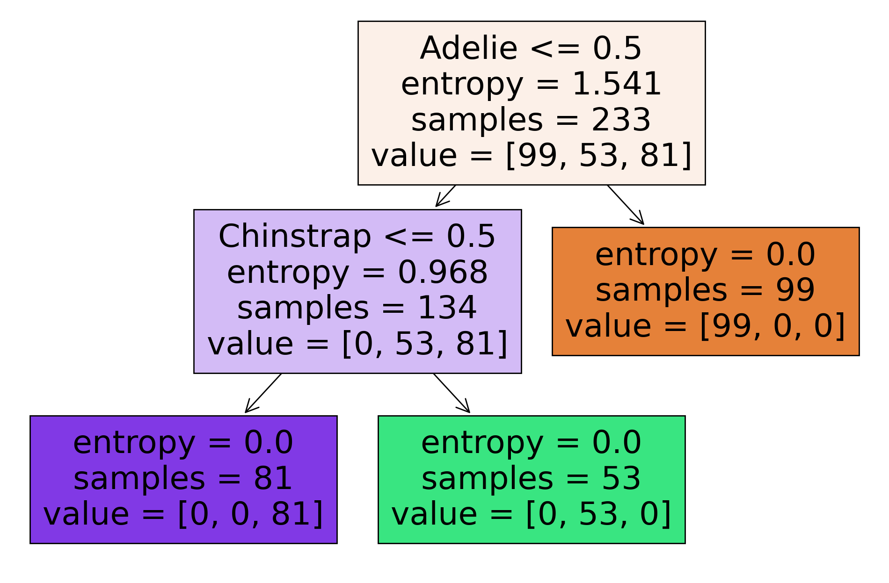

```python
import numpy as np 
import pandas as pd
from sklearn.tree import DecisionTreeClassifier
import matplotlib.pyplot as plt
from sklearn import metrics
```

## About Dataset
These data are originally published in:

Gorman KB, Williams TD, Fraser WR (2014) Ecological Sexual Dimorphism and Environmental Variability within a Community of Antarctic Penguins (Genus Pygoscelis). PLoS ONE 9(3): e90081. doi:10.1371/journal.pone.0090081


Summary:
The data folder contains a CSV files. 

penguins_size.csv: Simplified data from original penguin data sets. Contains variables:

species: penguin species (Chinstrap, Adélie, or Gentoo)
culmen_length_mm: culmen length (mm)
culmen_depth_mm: culmen depth (mm)
flipper_length_mm: flipper length (mm)
body_mass_g: body mass (g)
island: island name (Dream, Torgersen, or Biscoe) in the Palmer Archipelago (Antarctica)
sex: penguin sex

What are culmen length & depth?
The culmen is "the upper ridge of a bird's beak" (definition from Oxford Languages).


<div id="downloading_data"> 
    <h2>Downloading the Data</h2>
    To download the data, we will use !wget to download it from IBM Object Storage.
</div>


Now, read the data using pandas dataframe:


```python
my_data = pd.read_csv("penguins_size.csv", delimiter=",")
my_data.head()
#my_data.info()
```


<div>
<style scoped>
    .dataframe tbody tr th:only-of-type {
        vertical-align: middle;
    }

    .dataframe tbody tr th {
        vertical-align: top;
    }

    .dataframe thead th {
        text-align: right;
    }
</style>
<table border="1" class="dataframe">
  <thead>
    <tr style="text-align: right;">
      <th></th>
      <th>species</th>
      <th>island</th>
      <th>culmen_length_mm</th>
      <th>culmen_depth_mm</th>
      <th>flipper_length_mm</th>
      <th>body_mass_g</th>
      <th>sex</th>
    </tr>
  </thead>
  <tbody>
    <tr>
      <th>0</th>
      <td>Adelie</td>
      <td>Torgersen</td>
      <td>39.1</td>
      <td>18.7</td>
      <td>181.0</td>
      <td>3750.0</td>
      <td>MALE</td>
    </tr>
    <tr>
      <th>1</th>
      <td>Adelie</td>
      <td>Torgersen</td>
      <td>39.5</td>
      <td>17.4</td>
      <td>186.0</td>
      <td>3800.0</td>
      <td>FEMALE</td>
    </tr>
    <tr>
      <th>2</th>
      <td>Adelie</td>
      <td>Torgersen</td>
      <td>40.3</td>
      <td>18.0</td>
      <td>195.0</td>
      <td>3250.0</td>
      <td>FEMALE</td>
    </tr>
    <tr>
      <th>3</th>
      <td>Adelie</td>
      <td>Torgersen</td>
      <td>NaN</td>
      <td>NaN</td>
      <td>NaN</td>
      <td>NaN</td>
      <td>NaN</td>
    </tr>
    <tr>
      <th>4</th>
      <td>Adelie</td>
      <td>Torgersen</td>
      <td>36.7</td>
      <td>19.3</td>
      <td>193.0</td>
      <td>3450.0</td>
      <td>FEMALE</td>
    </tr>
  </tbody>
</table>
</div>


## Pre-processing:  Feature selection/extraction
<ul>
    <li> <b> X </b> as the <b> Feature Matrix </b> (data of my_data) </li>
    <li> <b> y </b> as the <b> response vector </b> (target) </li>
</ul>

**Use one hot encoding technique to conver categorical varables to binary variables and append them to the feature Data Frame**


```python
my_data['species'].value_counts() 
```


    Adelie       152
    Gentoo       124
    Chinstrap     68
    Name: species, dtype: int64


```python
my_data['island'].value_counts() 
```


    Biscoe       168
    Dream        124
    Torgersen     52
    Name: island, dtype: int64


```python
my_data['sex'].value_counts() 
```


    MALE      168
    FEMALE    165
    .           1
    Name: sex, dtype: int64


```python
my_data.drop(my_data.index[my_data['sex'] == '.'], inplace=True)
```


```python
my_data['sex'].value_counts() 
```


    MALE      168
    FEMALE    165
    Name: sex, dtype: int64


```python
my_data['sex'].replace(to_replace=['MALE','FEMALE'], value=[0,1],inplace=True)
my_data=my_data.dropna()
my_data.head()
```


<div>
<style scoped>
    .dataframe tbody tr th:only-of-type {
        vertical-align: middle;
    }

    .dataframe tbody tr th {
        vertical-align: top;
    }

    .dataframe thead th {
        text-align: right;
    }
</style>
<table border="1" class="dataframe">
  <thead>
    <tr style="text-align: right;">
      <th></th>
      <th>species</th>
      <th>island</th>
      <th>culmen_length_mm</th>
      <th>culmen_depth_mm</th>
      <th>flipper_length_mm</th>
      <th>body_mass_g</th>
      <th>sex</th>
    </tr>
  </thead>
  <tbody>
    <tr>
      <th>0</th>
      <td>Adelie</td>
      <td>Torgersen</td>
      <td>39.1</td>
      <td>18.7</td>
      <td>181.0</td>
      <td>3750.0</td>
      <td>0.0</td>
    </tr>
    <tr>
      <th>1</th>
      <td>Adelie</td>
      <td>Torgersen</td>
      <td>39.5</td>
      <td>17.4</td>
      <td>186.0</td>
      <td>3800.0</td>
      <td>1.0</td>
    </tr>
    <tr>
      <th>2</th>
      <td>Adelie</td>
      <td>Torgersen</td>
      <td>40.3</td>
      <td>18.0</td>
      <td>195.0</td>
      <td>3250.0</td>
      <td>1.0</td>
    </tr>
    <tr>
      <th>4</th>
      <td>Adelie</td>
      <td>Torgersen</td>
      <td>36.7</td>
      <td>19.3</td>
      <td>193.0</td>
      <td>3450.0</td>
      <td>1.0</td>
    </tr>
    <tr>
      <th>5</th>
      <td>Adelie</td>
      <td>Torgersen</td>
      <td>39.3</td>
      <td>20.6</td>
      <td>190.0</td>
      <td>3650.0</td>
      <td>0.0</td>
    </tr>
  </tbody>
</table>
</div>


```python
Feature = my_data[['species','culmen_length_mm','culmen_depth_mm','flipper_length_mm','body_mass_g', 'sex']]
Feature = pd.concat([Feature,pd.get_dummies(my_data['species'])], axis=1)
Feature.drop(['species'], axis=1, inplace=True)

```


```python
Feature.head()
```


<div>
<style scoped>
    .dataframe tbody tr th:only-of-type {
        vertical-align: middle;
    }

    .dataframe tbody tr th {
        vertical-align: top;
    }

    .dataframe thead th {
        text-align: right;
    }
</style>
<table border="1" class="dataframe">
  <thead>
    <tr style="text-align: right;">
      <th></th>
      <th>culmen_length_mm</th>
      <th>culmen_depth_mm</th>
      <th>flipper_length_mm</th>
      <th>body_mass_g</th>
      <th>sex</th>
      <th>Adelie</th>
      <th>Chinstrap</th>
      <th>Gentoo</th>
    </tr>
  </thead>
  <tbody>
    <tr>
      <th>0</th>
      <td>39.1</td>
      <td>18.7</td>
      <td>181.0</td>
      <td>3750.0</td>
      <td>0.0</td>
      <td>1</td>
      <td>0</td>
      <td>0</td>
    </tr>
    <tr>
      <th>1</th>
      <td>39.5</td>
      <td>17.4</td>
      <td>186.0</td>
      <td>3800.0</td>
      <td>1.0</td>
      <td>1</td>
      <td>0</td>
      <td>0</td>
    </tr>
    <tr>
      <th>2</th>
      <td>40.3</td>
      <td>18.0</td>
      <td>195.0</td>
      <td>3250.0</td>
      <td>1.0</td>
      <td>1</td>
      <td>0</td>
      <td>0</td>
    </tr>
    <tr>
      <th>4</th>
      <td>36.7</td>
      <td>19.3</td>
      <td>193.0</td>
      <td>3450.0</td>
      <td>1.0</td>
      <td>1</td>
      <td>0</td>
      <td>0</td>
    </tr>
    <tr>
      <th>5</th>
      <td>39.3</td>
      <td>20.6</td>
      <td>190.0</td>
      <td>3650.0</td>
      <td>0.0</td>
      <td>1</td>
      <td>0</td>
      <td>0</td>
    </tr>
  </tbody>
</table>
</div>


```python
X=Feature
X[0:5]

```


<div>
<style scoped>
    .dataframe tbody tr th:only-of-type {
        vertical-align: middle;
    }

    .dataframe tbody tr th {
        vertical-align: top;
    }

    .dataframe thead th {
        text-align: right;
    }
</style>
<table border="1" class="dataframe">
  <thead>
    <tr style="text-align: right;">
      <th></th>
      <th>culmen_length_mm</th>
      <th>culmen_depth_mm</th>
      <th>flipper_length_mm</th>
      <th>body_mass_g</th>
      <th>sex</th>
      <th>Adelie</th>
      <th>Chinstrap</th>
      <th>Gentoo</th>
    </tr>
  </thead>
  <tbody>
    <tr>
      <th>0</th>
      <td>39.1</td>
      <td>18.7</td>
      <td>181.0</td>
      <td>3750.0</td>
      <td>0.0</td>
      <td>1</td>
      <td>0</td>
      <td>0</td>
    </tr>
    <tr>
      <th>1</th>
      <td>39.5</td>
      <td>17.4</td>
      <td>186.0</td>
      <td>3800.0</td>
      <td>1.0</td>
      <td>1</td>
      <td>0</td>
      <td>0</td>
    </tr>
    <tr>
      <th>2</th>
      <td>40.3</td>
      <td>18.0</td>
      <td>195.0</td>
      <td>3250.0</td>
      <td>1.0</td>
      <td>1</td>
      <td>0</td>
      <td>0</td>
    </tr>
    <tr>
      <th>4</th>
      <td>36.7</td>
      <td>19.3</td>
      <td>193.0</td>
      <td>3450.0</td>
      <td>1.0</td>
      <td>1</td>
      <td>0</td>
      <td>0</td>
    </tr>
    <tr>
      <th>5</th>
      <td>39.3</td>
      <td>20.6</td>
      <td>190.0</td>
      <td>3650.0</td>
      <td>0.0</td>
      <td>1</td>
      <td>0</td>
      <td>0</td>
    </tr>
  </tbody>
</table>
</div>


```python
y = my_data["species"]
y.value_counts()


```


    Adelie       146
    Gentoo       119
    Chinstrap     68
    Name: species, dtype: int64


<hr>

<div id="setting_up_tree">
    <h2>Setting up the Decision Tree</h2>
    We will be using <b>train/test split</b> on our <b>decision tree</b>. Let's import <b>train_test_split</b> from <b>sklearn.cross_validation</b>.
</div>


```python
from sklearn.model_selection import train_test_split
```

Now <b> train_test_split </b> will return 4 different parameters. We will name them:<br>
X_trainset, X_testset, y_trainset, y_testset <br> <br>
The <b> train_test_split </b> will need the parameters: <br>
X, y, test_size=0.3, and random_state=3. <br> <br>
The <b>X</b> and <b>y</b> are the arrays required before the split, the <b>test_size</b> represents the ratio of the testing dataset, and the <b>random_state</b> ensures that we obtain the same splits.


```python
X_train, X_test, y_train, y_test = train_test_split(X, y, test_size=0.3, random_state=3)
```

<hr>

<div id="Decision Tree">
    <h2>Modeling</h2>
    We will first create an instance of the <b>DecisionTreeClassifier</b> called <b>drugTree</b>.<br>
    Inside of the classifier, specify <i> criterion="entropy" </i> so we can see the information gain of each node.
</div>


**Loop over tree deepth**


```python
accuracy=[]
for depth in range(1,10):
    decTree = DecisionTreeClassifier(criterion = 'entropy', max_depth = depth)
    decTree.fit(X_train,y_train)
    predTree = decTree.predict(X_test)
    accuracy.append(metrics.accuracy_score(y_test, predTree))
    print("For depth = {}  the accuracy score is {} ".format(depth, accuracy[depth-1] ))
```

    For depth = 1  the accuracy score is 0.85 
    For depth = 2  the accuracy score is 1.0 
    For depth = 3  the accuracy score is 1.0 
    For depth = 4  the accuracy score is 1.0 
    For depth = 5  the accuracy score is 1.0 
    For depth = 6  the accuracy score is 1.0 
    For depth = 7  the accuracy score is 1.0 
    For depth = 8  the accuracy score is 1.0 
    For depth = 9  the accuracy score is 1.0 
    


```python
best_accuracy=max(accuracy)
best_deepth = accuracy.index(best_accuracy)+1
print("The best value of accuracy score is {} is for depth  {}".format( best_accuracy, best_deepth))
```

    The best value of accuracy score is 1.0 is for depth  2
    


```python
#Best decision tree classifier
decTree = DecisionTreeClassifier(criterion="entropy", max_depth = best_deepth)
# Training
decTree.fit(X_train,y_train)
```


    DecisionTreeClassifier(criterion='entropy', max_depth=2)


<hr>

<div id="prediction">
    <h2>Prediction</h2>
    Let's make some <b>predictions</b> on the testing dataset and store it into a variable called <b>predTree</b>.
</div>


```python
predTree = decTree.predict(X_test)
```

<hr>

<div id="evaluation">
    <h2>Evaluation and Visualization</h2>
    Next, let's import <b>metrics</b> from sklearn and check the accuracy of our model.
</div>


```python
print("DecisionTrees's Accuracy: ", metrics.accuracy_score(y_test, predTree))
```

    DecisionTrees's Accuracy:  1.0
    


```python
from sklearn.tree import plot_tree
plt.figure(figsize=(12,8),dpi=200)
plot_tree(decTree,feature_names=Feature.columns,filled=True);
```


    

    


```python

```
